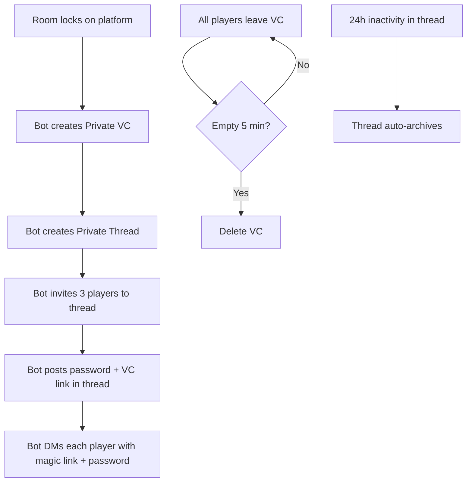

# Discord Temporary Channels Design

## Overview

When a room locks (full + all ready):
1. **Private Voice Channel** — only party members can see/join
2. **Private Thread** — only party members can view/chat

---

## Private Voice Channel

### Creation

When room locks, bot creates VC with permission overwrites:

```
Permission Overwrites:
├── @everyone: view_channel=False, connect=False
├── Player1: view_channel=True, connect=True
├── Player2: view_channel=True, connect=True
└── Player3: view_channel=True, connect=True
```

Result: Only the 3 party members can see and join the VC.

### Naming

```
{Boss}-{Password}

Examples:
├── Gladius-Nx882
├── Messmer-Kz445
└── Balancers-Qw123
```

### Settings

| Setting | Value |
|---------|-------|
| User Limit | 3 (or 6 for Seamless) |
| Category | #nightreign-lobbies |
| Bitrate | Default (64kbps) |

### Lifecycle

```
Room locks → Bot creates private VC
                    │
                    ▼
          Bot sends invite link to:
          • Private thread
          • DM to each player
                    │
                    ▼
          Players click to join VC
                    │
                    ▼
          Run ends / players leave
                    │
                    ▼
          VC empty for 5 min → Bot deletes VC
```

---

## Private Thread

### Creation

Bot creates private thread in a parent channel (e.g., `#lfg-rooms`):

```
Parent Channel: #lfg-rooms (public channel)
     │
     └── Private Thread: "Gladius | Nx882"
              └── Only invited members can see
```

### Settings

| Setting | Value |
|---------|-------|
| Type | Private Thread |
| Auto-archive | 24 hours |
| Invitees | 3 party members only |

### Initial Message

```
┌────────────────────────────────────────────────────────────┐
│ 🎮 ROOM READY — Gladius                                    │
├────────────────────────────────────────────────────────────┤
│                                                            │
│ PASSWORD                                                   │
│                                                            │
│              Nx882                    [📋 Copy]            │
│                                                            │
│ Enter in Elden Ring → Multiplayer → Password              │
├────────────────────────────────────────────────────────────┤
│                                                            │
│ VOICE CHANNEL                                              │
│                                                            │
│              [🔊 Join Voice]                               │
│                                                            │
├────────────────────────────────────────────────────────────┤
│                                                            │
│ TEAM                                                       │
│ • @WarriorKing (Host)                                     │
│ • @Player_A                                               │
│ • @Player_B                                               │
│                                                            │
└────────────────────────────────────────────────────────────┘
```

### Lifecycle

```
Room locks → Bot creates private thread
                    │
                    ▼
          Bot invites 3 players to thread
                    │
                    ▼
          Bot posts room info (password, VC link)
                    │
                    ▼
          Players chat during session
                    │
                    ▼
          24h inactivity → Thread auto-archives
```

---

## Complete Flow



---

## Bot Permissions Required

```
MANAGE_CHANNELS        — Create/delete VCs
MANAGE_THREADS        — Create/manage private threads
SEND_MESSAGES         — Post in channels/threads
CREATE_PRIVATE_THREADS — Create private threads
VIEW_CHANNEL          — Access parent channel
CONNECT               — Connect to VCs (for validation)
```

---

## Server Requirements

| Requirement | Why |
|-------------|-----|
| Server Boost Level 2 | Required for private threads |
| Parent channel for threads | e.g., #lfg-rooms |
| Category for VCs | e.g., #nightreign-lobbies |

---

## Requirements Summary

**Voice Channel:**

| ID | Requirement |
|----|-------------|
| REQ-VC-01 | Create private VC when room locks |
| REQ-VC-02 | Permission: only 3 party members can see/join |
| REQ-VC-03 | Name format: `{Boss}-{Password}` |
| REQ-VC-04 | User limit: party size (3 or 6) |
| REQ-VC-05 | Delete after 5 min empty |
| REQ-VC-06 | Send invite link to thread + DMs |

**Thread:**

| ID | Requirement |
|----|-------------|
| REQ-TH-01 | Create private thread when room locks |
| REQ-TH-02 | Invite only 3 party members |
| REQ-TH-03 | Name format: `{Boss} \| {Password}` |
| REQ-TH-04 | Auto-archive: 24 hours |
| REQ-TH-05 | Post password + VC link as first message |
