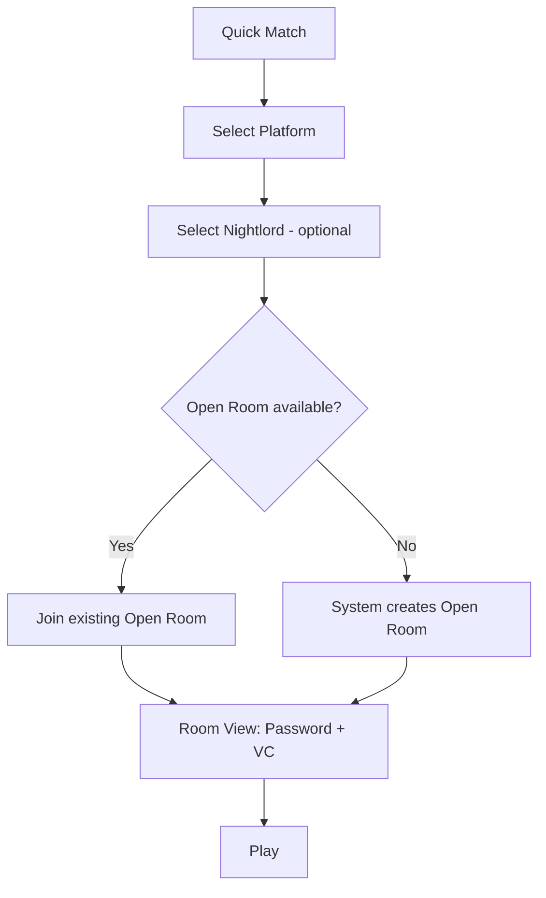
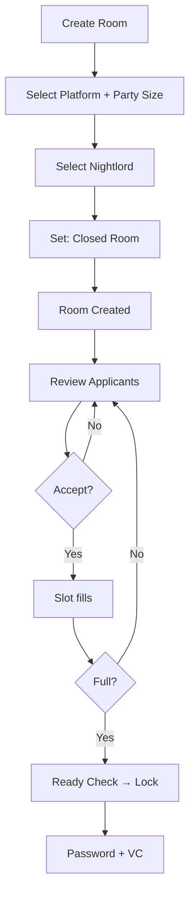
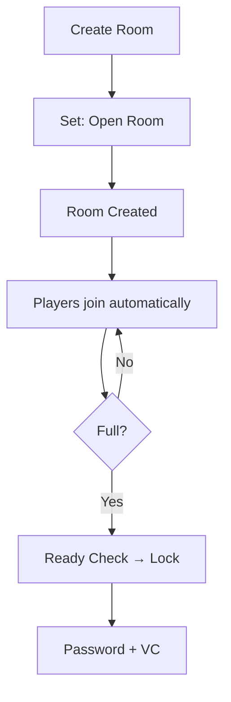
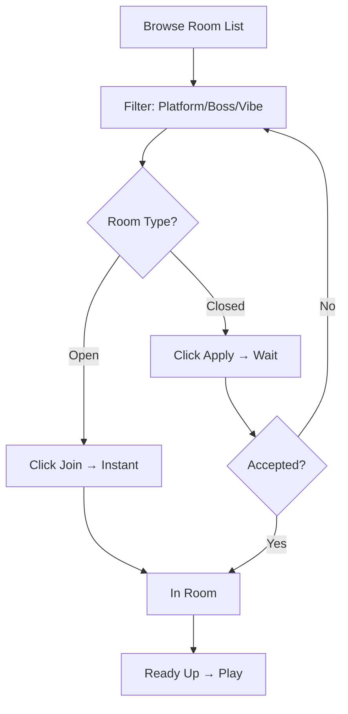
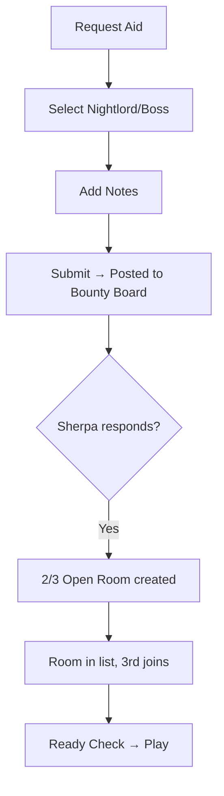
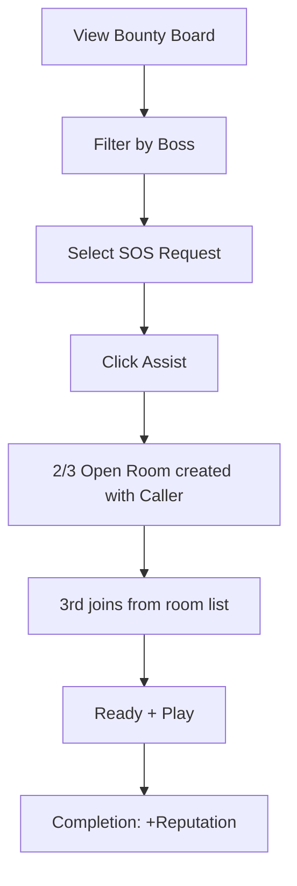

# User Journey Design

## Nightreign Gameplay Context

```
┌─────────────────────────────────────────────────────────────────────┐
│                    NIGHTREIGN RUN STRUCTURE                         │
├─────────────────────────────────────────────────────────────────────┤
│                                                                     │
│  NIGHT 1                    NIGHT 2                    NIGHT 3      │
│  ┌─────────────────┐       ┌─────────────────┐       ┌───────────┐ │
│  │ Explore map     │       │ Explore map     │       │           │ │
│  │ (shrinking zone)│  ──►  │ (shrinking zone)│  ──►  │ NIGHTLORD │ │
│  │ Collect loot    │       │ Collect loot    │       │   BOSS    │ │
│  │ Level up        │       │ Level up        │       │           │ │
│  ├─────────────────┤       ├─────────────────┤       └───────────┘ │
│  │ NIGHT BOSS      │       │ NIGHT BOSS      │                     │
│  └─────────────────┘       └─────────────────┘                     │
│                                                                     │
│  Total run: 45-60 minutes                                          │
└─────────────────────────────────────────────────────────────────────┘
```

---

## Platform Matrix

| Platform | Max Players | Notes |
|----------|:-----------:|-------|
| PC (Native) | 3 | Standard |
| PlayStation | 3 | Standard |
| Xbox | 3 | Standard |
| PC (Seamless Coop) | 6 | Mod-based |

---

## Room Model

| Room Type | Description |
|-----------|-------------|
| **Open Room** | Anyone can join instantly |
| **Closed Room** | Host approves each applicant |

---

## Journey 1: Quick Match



---

## Journey 2: War Room — Host

### Closed Room (Manual Approval)



### Open Room (Auto-Fill)



---

## Journey 3: War Room — Seeker



**Note:** Seekers can apply to multiple Closed Rooms simultaneously.

---

## Journey 4: SOS — Caller



---

## Journey 5: SOS — Sherpa



---

## UI Components

### Room Card

```
┌────────────────────────────────────────────────────────┐
│ 🔓 Gladius                                  2/3 ●●○   │
│ PC | Chill | No Mic              Host: WarriorKing    │
│ Open Room                          [Join Instantly]   │
└────────────────────────────────────────────────────────┘
```

### Match View (Password Display)

```
┌────────────────────────────────────────────────────────┐
│                  🎮 READY TO PLAY                      │
│                                                        │
│  PASSWORD                                              │
│  ┌──────────────────────────────────────────────────┐ │
│  │                    Nx882                         │ │
│  └──────────────────────────────────────────────────┘ │
│                    [📋 Copy]                          │
│                                                        │
│            [🔊 Join Voice Channel]                    │
│                                                        │
│  TEAM: WarriorKing • Player_A • You                   │
└────────────────────────────────────────────────────────┘
```

---

## Summary

```
┌─────────────────────────────────────────────────────────────────────┐
│                           DASHBOARD                                 │
│                                                                     │
│   ┌───────────────┐  ┌───────────────┐  ┌───────────────┐          │
│   │ QUICK MATCH   │  │   WAR ROOM    │  │      SOS      │          │
│   │               │  │               │  │               │          │
│   │ Auto-join or  │  │ [Create Room] │  │ [Request Aid] │          │
│   │ create Open   │  │ ├─ Open       │  │ [Bounty Board]│          │
│   │ Room          │  │ └─ Closed     │  │               │          │
│   │               │  │ [Browse Rooms]│  │               │          │
│   └───────────────┘  └───────────────┘  └───────────────┘          │
│                              │                                      │
│                              ▼                                      │
│                    ┌─────────────────┐                             │
│                    │ ROOM → Password │                             │
│                    │      → VC       │                             │
│                    │      → Play     │                             │
│                    └─────────────────┘                             │
│                                                                     │
└─────────────────────────────────────────────────────────────────────┘
```
