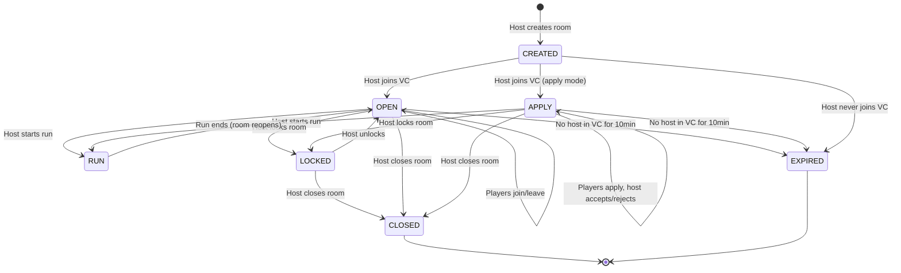
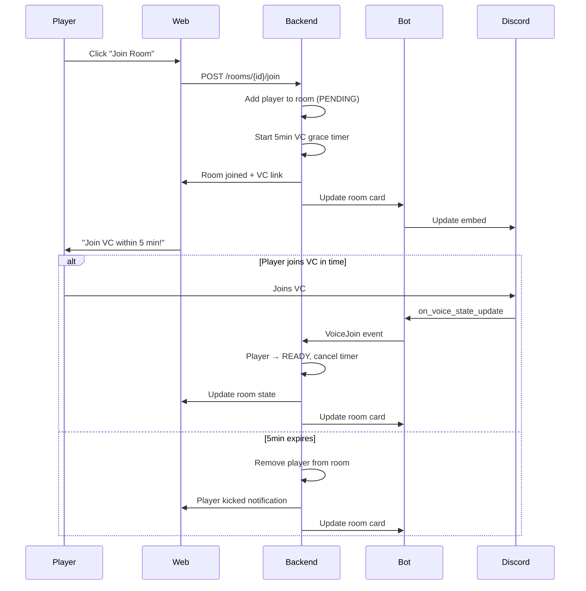
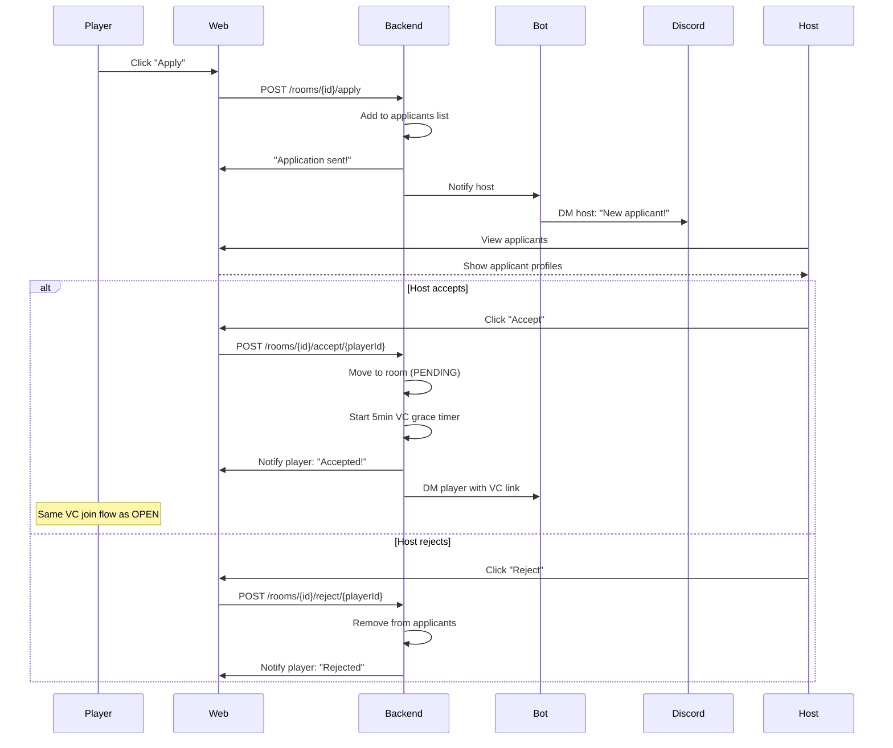
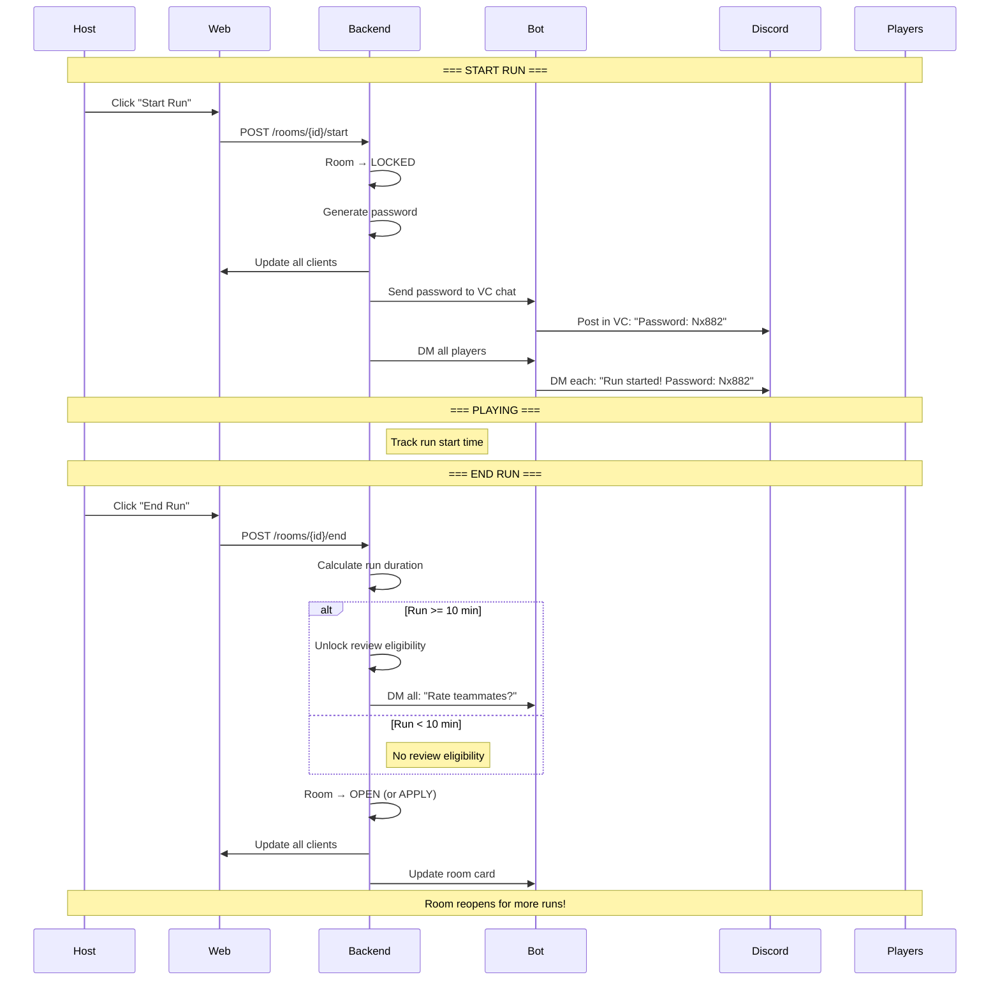
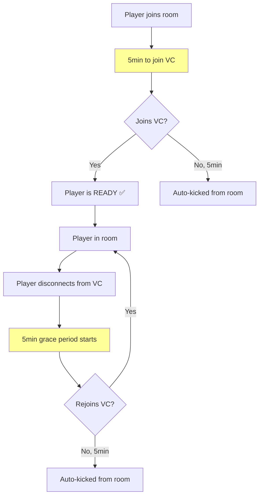
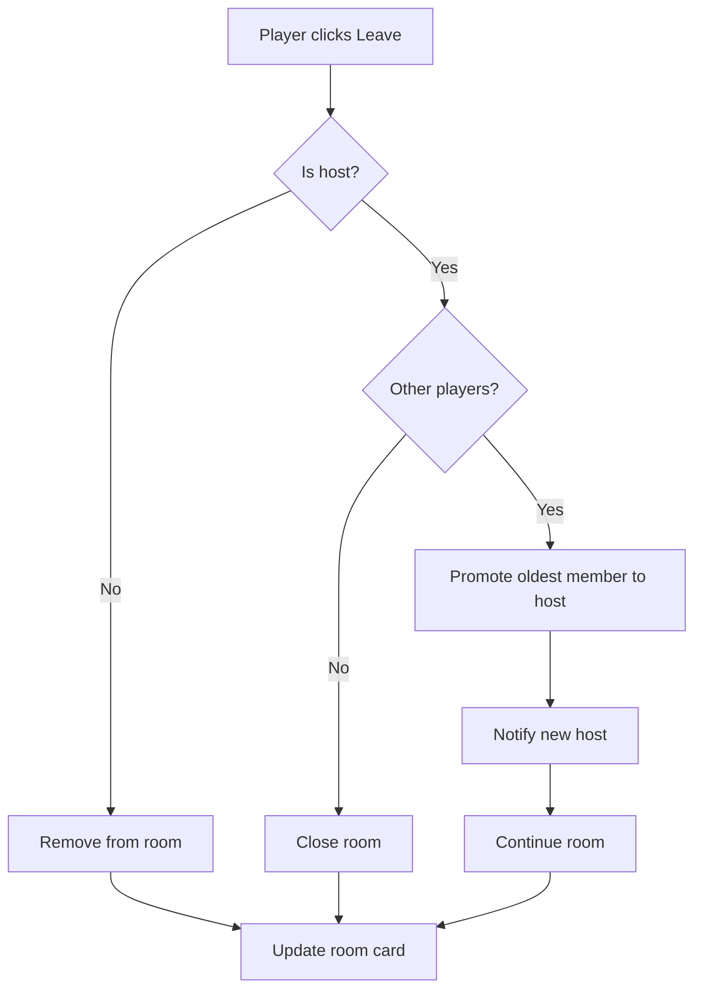
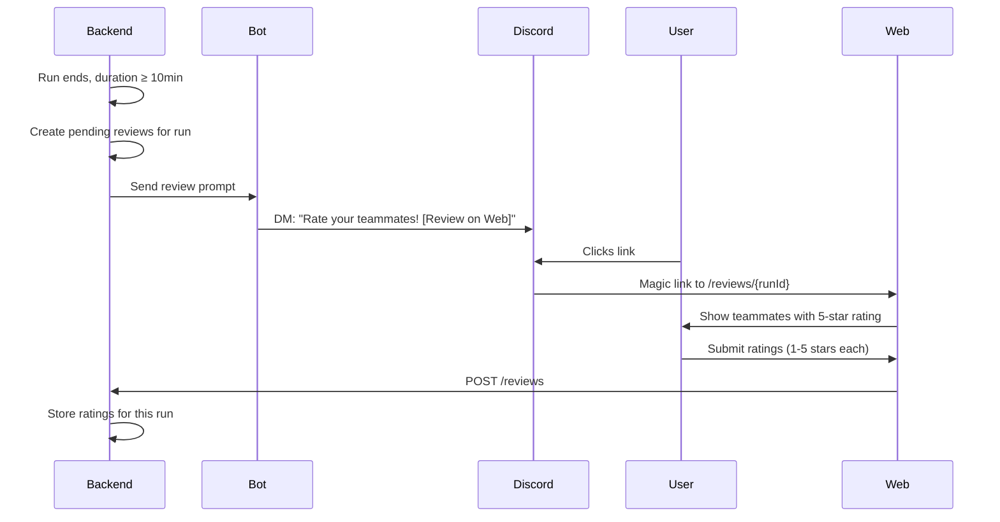

# Room Lifecycle Design: VC-as-Presence Model (v2)

## Core Principles

> **VC presence = Room membership**
> - Join room → 5min to connect to VC or auto-kicked
> - In VC = in room
> - Leave VC = grace period → kicked if not rejoined
> - VC empty = room closed

No separate threads - use VC's built-in text chat.

---

## Room Modes

| Mode | Description | Who Can Join |
|------|-------------|--------------|
| **OPEN** | Anyone can join instantly | Anyone |
| **APPLY** | Host reviews and accepts/rejects | Must apply, host decides |
| **RUN** | Run in progress | No one (in-game) |
| **LOCKED** | Host manually locked the room | No one |

---

## Room Sizes

| Platform | Max Players |
|----------|:-----------:|
| PC / PlayStation / Xbox | 3 |
| PC (Seamless Co-op Mod) | 6 |

---

## State Machine

---

## Join Flow: OPEN Room

---

## Join Flow: APPLY Room

---

## Run Lifecycle

---

## Grace Period (All States)

Every player in the room must stay in VC. Grace period applies universally.

---

## Host Actions

| Action | Endpoint | Effect |
|--------|----------|--------|
| **Start Run** | `POST /rooms/{id}/start` | Lock room, send password |
| **End Run** | `POST /rooms/{id}/end` | Unlock room, prompt reviews if eligible |
| **Kick Player** | `POST /rooms/{id}/kick/{userId}` | Remove player immediately |
| **Close Room** | `DELETE /rooms/{id}` | Delete room and VC |
| **Change Mode** | `PATCH /rooms/{id}` | Switch between OPEN/APPLY |

---

## Leave Room & Host Transfer

---

## Review System

### Eligibility

| Condition | Rule |
|-----------|------|
| Run duration | Must be ≥ 10 minutes |
| Same run | Must have been in the same run together |
| Per run | Each user can rate another user **once per valid run** |

### Flow

### Web Rating UI

| Element | Description |
|---------|-------------|
| Teammate cards | Avatar, name, reputation tier |
| 5-star rating | Click to rate 1-5 stars |
| Optional comment | Text field (optional) |
| Skip button | Skip rating this player |

---

## Update Targets

When room state changes, update BOTH:

| Target | Method |
|--------|--------|
| **Web** | WebSocket push to all connected clients |
| **Discord** | Bot updates embed in #lfg |

---

## API Endpoints

### Room Management
| Endpoint | Action |
|----------|--------|
| `POST /rooms` | Create room |
| `GET /rooms` | List active rooms |
| `GET /rooms/{id}` | Room details |
| `PATCH /rooms/{id}` | Update room settings |
| `DELETE /rooms/{id}` | Close room |

### Player Actions
| Endpoint | Action |
|----------|--------|
| `POST /rooms/{id}/join` | Join open room |
| `POST /rooms/{id}/leave` | Leave room |
| `POST /rooms/{id}/apply` | Apply to room |

### Host Actions
| Endpoint | Action |
|----------|--------|
| `POST /rooms/{id}/accept/{userId}` | Accept applicant |
| `POST /rooms/{id}/reject/{userId}` | Reject applicant |
| `POST /rooms/{id}/kick/{userId}` | Kick player |
| `POST /rooms/{id}/start` | Start run |
| `POST /rooms/{id}/end` | End run |

### Ratings
| Endpoint | Action |
|----------|--------|
| `POST /ratings` | Submit rating |
| `GET /ratings/{userId}` | Get user's rating summary |

---

## gRPC Events (Bot ↔ Backend)

| Direction | Event | Trigger |
|-----------|-------|---------|
| Backend → Bot | `CreateVC` | Room created |
| Bot → Backend | `VoiceJoin` | User joins VC |
| Bot → Backend | `VoiceLeave` | User leaves VC |
| Backend → Bot | `UpdateRoomCard` | Room state changes |
| Backend → Bot | `SendDM` | Notifications |
| Backend → Bot | `PostToVC` | Send message to VC chat |
| Backend → Bot | `DeleteVC` | Room closes |
