# Room Lifecycle Design: VC-as-Presence Model

## Core Principle

> **VC presence = Room membership**
> 
> - Join room on platform → must join VC to be "Ready"
> - In VC = in room
> - Leave VC = leave room (with grace period)
> - VC empty = room closed

No separate threads needed - VC channels have built-in text chat.

---

## State Machine

---

## Sequence Diagram: Complete Flow

```mermaid
sequenceDiagram
    participant Host
    participant Web/Bot
    participant Backend
    participant Discord
    participant Player

    Note over Host,Player: === ROOM CREATION ===
    
    Host->>Web/Bot: Create room (boss, region, mic, etc)
    Web/Bot->>Backend: POST /rooms
    Backend->>Backend: Generate room + password
    Backend->>Discord: Create private VC in category
    Discord-->>Backend: VC created (channel_id)
    Backend-->>Web/Bot: Room created + VC link
    Web/Bot-->>Host: "Room created! Join VC to start"
    
    Note over Host,Player: === HOST JOINS VC ===
    
    Host->>Discord: Joins VC
    Discord->>Backend: on_voice_state_update (host joined)
    Backend->>Backend: Mark host as READY
    Backend->>Discord: Update room card embed
    
    Note over Host,Player: === PLAYERS JOIN ===
    
    Player->>Web/Bot: Browse rooms / Apply
    Web/Bot-->>Player: Room list with VC links
    Player->>Discord: Click VC link → Join VC
    Discord->>Backend: on_voice_state_update (player joined)
    Backend->>Backend: Mark player as READY
    Backend->>Discord: Update room card (2/3)
    
    Note over Host,Player: === ROOM FULL ===
    
    Discord->>Backend: 3rd player joins VC
    Backend->>Backend: Room FULL + all READY
    Backend->>Discord: Post in VC chat: "All ready! 🎮"
    Backend->>Discord: DM all: Password + "Good luck!"
    
    Note over Host,Player: === PLAYING ===
    
    Host->>Web/Bot: Click "Start Run" (optional)
    Note right of Backend: Or auto-start when full
    
    Note over Host,Player: === DISCONNECT HANDLING ===
    
    Player->>Discord: Disconnects from VC
    Discord->>Backend: on_voice_state_update (player left)
    Backend->>Backend: Start 5min grace timer
    Backend->>Discord: DM player: "Disconnected! Rejoin within 5min"
    
    alt Player rejoins
        Player->>Discord: Rejoins VC
        Backend->>Backend: Cancel grace timer
    else Grace period expires
        Backend->>Backend: Mark player as LEFT
        Backend->>Discord: Update room card (2/3)
        Backend->>Discord: Notify VC: "Player left the room"
    end
    
    Note over Host,Player: === RUN ENDS ===
    
    alt Host ends run
        Host->>Web/Bot: Click "End Run"
    else All leave VC
        Discord->>Backend: VC empty
    end
    
    Backend->>Backend: Room → CLOSING
    Backend->>Discord: DM all: Rating prompt
    
    Note over Host,Player: === REVIEWS ===
    
    Host->>Discord: Rate teammates (👍/👎/Skip)
    Player->>Discord: Rate teammates
    Backend->>Backend: Update reputation scores
    Backend->>Backend: Room → CLOSED
    Backend->>Discord: Delete VC (or after 5min empty)
```

---

## Activity Diagram: Join Room Flow

---

## Disconnect Handling Detail

---

## Edge Cases

### 1. Host Never Joins VC

### 2. Player Joins Platform but Not VC

```mermaid
flowchart LR
    A[Player in room on web] --> B[Not in VC = NOT READY]
    B --> C[Show in room as ⏳ Waiting]
    C --> D[Cannot participate until in VC]
```

### 3. Someone Joins VC Uninvited

### 4. Multiple Runs in Same Room

### 5. Host Leaves Mid-Run

---

## Room States Summary

| State | VC Status | Host | Players | Actions Available |
|-------|-----------|------|---------|-------------------|
| `CREATED` | VC exists | Not in VC | - | Host must join VC |
| `WAITING` | Empty | In VC | - | Waiting for players |
| `FILLING` | 1-2 members | In VC | Some in VC | Join, leave |
| `READY` | Full | In VC | All in VC | Start run |
| `PLAYING` | Full | In VC | All in VC | End run, leave |
| `CLOSING` | Any | Any | Any | Rate teammates |
| `CLOSED` | Deleted | - | - | - |
| `EXPIRED` | Deleted | - | - | - |

---

## Key Design Decisions

| Decision | Choice | Rationale |
|----------|--------|-----------|
| VC presence = membership | ✅ Yes | Only way to track who's actually playing |
| Separate thread | ❌ No | VC has built-in text chat |
| Grace period on disconnect | 5 min | Handles accidental disconnects |
| Multiple runs per room | ✅ Yes | Host can reuse room |
| Reviews | After room closes | Prompt via DM |
| Host transfer | ✅ Yes | If host leaves, promote member |

---

## API Endpoints

| Endpoint | Action |
|----------|--------|
| `POST /rooms` | Create room |
| `GET /rooms` | List active rooms |
| `GET /rooms/{id}` | Room details |
| `POST /rooms/{id}/apply` | Apply to closed room |
| `POST /rooms/{id}/accept/{userId}` | Accept applicant |
| `POST /rooms/{id}/start` | Start run (optional) |
| `POST /rooms/{id}/end` | End run, trigger reviews |
| `DELETE /rooms/{id}` | Close room |

---

## gRPC Events (Bot ↔ Backend)

| Direction | Event | Trigger |
|-----------|-------|---------|
| Backend → Bot | `CreateVC` | Room created |
| Bot → Backend | `VoiceJoin` | User joins VC |
| Bot → Backend | `VoiceLeave` | User leaves VC |
| Backend → Bot | `UpdateRoomCard` | Room state changes |
| Backend → Bot | `SendDM` | Notifications |
| Backend → Bot | `DeleteVC` | Room closes |
